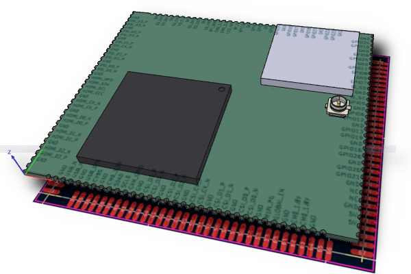

## CM0 datasheets and design files

[User aBUGSworstnightmare](https://forums.raspberrypi.com/memberlist.php?mode=viewprofile&u=152468) mentioned in the [RaspberryPi.com forums post "Re: What's a CM0?"](https://forums.raspberrypi.com/viewtopic.php?p=2349313#p2349313) that there is extensive info available:

  * [CM0 datasheet (draft)[https://edatec.cn/storage/file/Raspberry%C2%A0Pi%C2%A0Compute%C2%A0Module%C2%A00-datasheet-draft-by%20Raspberry%20Pi.pdf]
  * [CM0 IO board schematics](http://edatec.cn/storage/file/CM0%20IO%20Rev1%20SCH.pdf)
  * [KiCAD design files](http://edatec.cn/storage/zip/20250920/d4be7476d8ce5a5a77f645ab08e852c5.zip)

As this makes this repository superfluous, it is archived now.

Thx for helping to collect info!

## CM0_preliminary

This repository contained (no archived) Raspberry Pi CM0 compute module preliminary datasheets and KiCAD design files.

They are considered "preliminary" until the advent of proper [official docu from Raspberry Pi](https://datasheets.raspberrypi.com/).

### Sources

  * [EDAtec Devkit info](https://edatec.cn/docs/zh/cm0)
  * [LCSC shop: CM0 Devkit](https://www.lcsc.com/product-detail/C51966415.html)
      currently no further info/datasheets/EasyEDA symbols, but Devkit and some CM0 modules in stock
  * [CNXSoft News about CM0](https://www.cnx-software.com/2025/09/23/raspberry-pi-cm0-castellated-module-features-raspberry-pi-rp3a0-system-in-package/)

### About

PDF documents from the EDAtec site concerning CM0 development kit were translated from Chinese to English with the help of _DeepL_.

The site mentions possible translation errors, so their info supposedly came from some English documentation.

KiCAD symbols, footprints, 3D files are done by myself with the info from the PDF.

